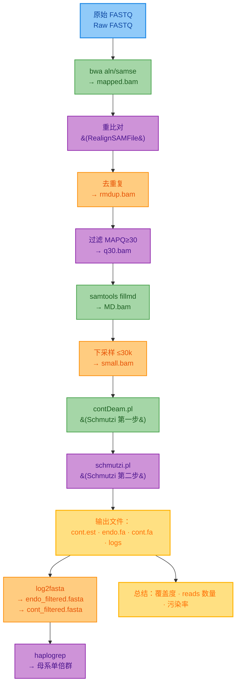

```mermaid
flowchart TD
  %% 样式定义
  classDef start fill:#90caf9,stroke:#1e88e5,color:#0d47a1,stroke-width:2px;
  classDef step1 fill:#a5d6a7,stroke:#43a047,color:#1b5e20,stroke-width:1.5px;
  classDef step2 fill:#ce93d8,stroke:#8e24aa,color:#4a148c,stroke-width:1.5px;
  classDef step3 fill:#ffcc80,stroke:#fb8c00,color:#e65100,stroke-width:1.5px;
  classDef output fill:#ffe082,stroke:#ffb300,color:#ff6f00,stroke-width:2px;

  %% 节点
  A[原始 FASTQ<br/>Raw FASTQ]:::start

  B[bwa aln/samse<br/>→ mapped.bam]:::step1
  C[重比对<br/>&#40;RealignSAMFile&#41;]:::step2
  D[去重复<br/>→ rmdup.bam]:::step3
  E[过滤 MAPQ≥30<br/>→ q30.bam]:::step2
  F[samtools fillmd<br/>→ MD.bam]:::step1
  G[下采样 ≤30k<br/>→ small.bam]:::step3

  H[contDeam.pl<br/>&#40;Schmutzi 第一步&#41;]:::step1
  I[schmutzi.pl<br/>&#40;Schmutzi 第二步&#41;]:::step2

  J[输出文件：<br/>cont.est · endo.fa · cont.fa · logs]:::output
  K[log2fasta<br/>→ endo_filtered.fasta<br/>→ cont_filtered.fasta]:::step3
  L[haplogrep<br/>→ 母系单倍群]:::step2
  M[总结：覆盖度 · reads 数量 · 污染率]:::output

  %% 连线（纵向）
  A --> B --> C --> D --> E --> F --> G --> H --> I --> J --> K --> L
  J --> M
```
